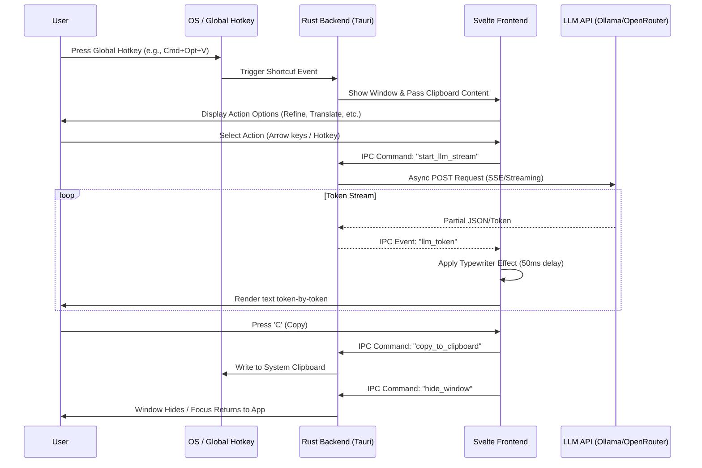
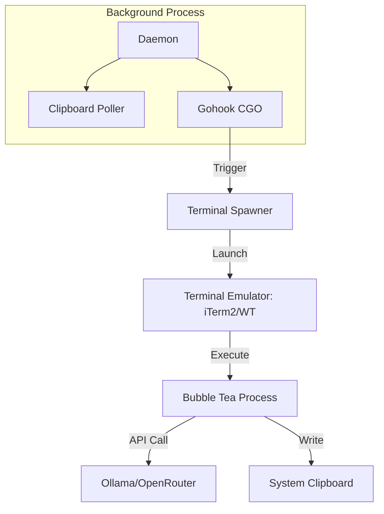
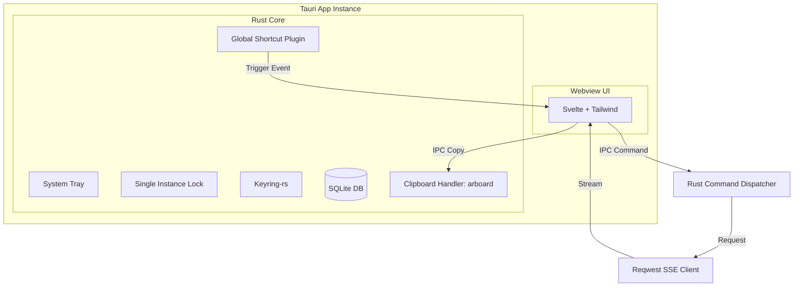

# quick-agent: Tauri + Rust Migration Design Guide

This document serves as the master blueprint for recreating `quick-agent` (also known as `clipboard-tui`) as a modern Tauri + Rust desktop application.

## 1. Executive Summary & Design Paradigm Shift

The migration of `quick-agent` from a Go-based CLI/TUI to a Tauri + Rust desktop application represents a strategic shift toward improved reliability, user experience, and maintainability.

### From Terminal Dependency to Native Webview
The original Go implementation relies on spawning external terminal emulators to host the Bubble Tea TUI. This approach is inherently fragile due to the vast diversity of terminal binaries (`wt`, `alacritty`, `iTerm2`, `gnome-terminal`) and OS-specific launch mechanisms (LaunchAgents, Systemd units, Scheduled Tasks).

By adopting **Tauri**, we eliminate the "terminal middleman." The application UI is rendered directly in a lightweight, native webview (powered by Svelte and Tailwind CSS). This ensures:
- **Instant Activation**: No more waiting for a terminal process to bootstrap; the window appears instantly via the global hotkey.
- **Visual Consistency**: A unified, sleek "terminal-like" aesthetic that remains consistent across Windows, macOS, and Linux.
- **Zero-CGO Rust Backend**: Leveraging the Rust ecosystem (e.g., `tauri-plugin-global-shortcut`, `arboard`) allows for native OS integration without the compilation headaches of CGO.

### User Flow Sequence Diagram
The following diagram illustrates the lifecycle of a typical user interaction, from the moment a global hotkey is triggered to the final text being copied.



## 2. Deep Feature-by-Feature Specification

This section maps core Go components to their Rust/Tauri equivalents, ensuring functional parity while leveraging modern async patterns.

### 2.1 Background Daemon & State Management
*   **Legacy (Go)**: A standalone `daemon` command that writes a `daemon.pid` and runs a foreground loop.
*   **Tauri Architecture**: The Tauri Core process acts as the permanent background daemon.
    *   **System Tray**: Uses Tauri's native tray API (or `tauri-plugin-positioner`) to provide a "Hide/Show" toggle and "Quit" option.
    *   **Single Instance**: Implemented via `tauri-plugin-single-instance` to prevent multiple daemon processes.
    *   **State**: Managed via a Rust `struct` wrapped in `tauri::State`, utilizing `tokio::sync::RwLock` for thread-safe access to application configuration and clipboard history.

### 2.2 Adaptive Clipboard Polling
*   **Legacy (Go)**: Adaptive polling loop (100ms on change, 500ms when idle) using `github.com/atotto/clipboard`.
*   **Rust Implementation**:
    *   **Crate**: `arboard` for cross-platform clipboard access.
    *   **Logic**: A dedicated `tokio::spawn` task that polls the clipboard.
    *   **Sanitization**: Rust-native `Sanitize` logic equivalent to the Go implementation:
        *   UTF-8 validation and cleaning via `String::from_utf8_lossy`.
        *   Hard limit of 100KB for clipboard content.
        *   Whitespace trimming and `... [TRUNCATED]` suffix for oversized text.

### 2.3 Global Hotkey Monitor
*   **Legacy (Go)**: Uses `gohook` (CGO) to capture keyboard events system-wide.
*   **Tauri Implementation**:
    *   **Plugin**: `tauri-plugin-global-shortcut`.
    *   **Behavior**: Registers `Cmd+Alt+V` (macOS) or `Ctrl+Alt+V` (Windows/Linux) on startup.
    *   **Debouncing**: 300ms debounce window implemented using a `tokio::time::Instant` timestamp check within the event handler to prevent rapid UI flicker.

### 2.4 "Terminal-Style" Svelte Overlay
The Bubble Tea TUI is replaced by a Svelte + Tailwind CSS frontend that mimics a terminal aesthetic.
*   **Initial View**: Displays the current clipboard snippet in a `<pre>` block with syntax-themed borders.
*   **Action Picker**: Keyboard-navigable list (j/k or Arrows) for Refine, Translate, Summarize, and Explain.
*   **Streaming Result View**:
    *   **Typewriter Effect**: Tokens received via Tauri events are pushed into a Svelte store. A component-level timer renders them with a forced 50ms delay per chunk to ensure a smooth "thinking" visual.
    *   **Keybindings**: `C` to copy, `Esc` to go back, `R` to retry the last LLM call.

### 2.5 LLM Integrations (Ollama & OpenRouter)
*   **Client**: `reqwest` for asynchronous HTTP requests.
*   **Streaming**:
    *   **Ollama**: Parses NDJSON stream (`{"response": "...", "done": false}`).
    *   **OpenRouter**: Parses Server-Sent Events (SSE) `data: {...}` chunks.
*   **Resiliency**: Implementation of a 3-attempt exponential backoff strategy using `tokio_retry` or a manual loop with `tokio::time::sleep`.

### 2.6 Persistence: SQLite & Keyring
*   **Configuration**: Unlike the Go version's `config.json`, settings (prompts, model selection, theme) are stored in a local **SQLite** database via `tauri-plugin-sql`.
*   **Secrets**: API keys for OpenRouter/Ollama are stored in the OS-native keyring using the `keyring` crate (integrating with Keychain, Credential Manager, or Secret Service).

## 3. Complete Architectural Diagrams (Mermaid)

### 3.1 Legacy Architecture (Go + TUI)


### 3.2 Target Architecture (Tauri + Rust)


### 3.3 Rust Threading & IPC Flow
```mermaid
graph LR
    subgraph "Main Thread (Tauri Core)"
        TC[Tauri Runtime Loop]
        GS[Global Shortcut Listener]
    end
    subgraph "Async Runtime (Tokio)"
        CP[Clipboard Polling Task]
        LS[LLM Streaming Task]
    end
    subgraph "Webview Process"
        FE[Svelte Store / UI]
    end

    GS -->|emit: hotkey-press| TC
    TC -->|window.show()| FE
    FE -->|invoke: start_stream| TC
    TC -->|spawn| LS
    LS -->|emit: token| FE
    CP -->|state_update| TC
```

## 4. Step-by-Step Porting Manual

This manual follows a vertical-slice methodology, ensuring a functional core is established early.

### Phase 1: Foundation & Window Management
1.  **Tauri Initialization**: Scaffolding the project using `npm create tauri-app` with the Svelte + TypeScript template.
2.  **Window Configuration**:
    *   Set the main window to `visible: false` by default.
    *   Apply `decorations: false` and `transparent: true` for a clean overlay feel.
    *   Configure `alwaysOnTop: true` and `center: true`.
3.  **Persistence Layer**:
    *   Integrate `tauri-plugin-sql` and define migrations for the `settings` and `prompts` tables.
    *   Set up `keyring-rs` integration for secure API key storage.
4.  **System Tray**: Add the tray icon and context menu (Show/Hide/Quit).

### Phase 2: Event Loop & UI Integration
1.  **Global Shortcuts**: Implement the `tauri-plugin-global-shortcut` handler. On trigger, it should focus the window and emit a frontend event.
2.  **Clipboard Polling**: Implement the `tokio` background loop using `arboard`. Store the sanitized text in a Rust `Mutex` or `RwLock`.
3.  **Svelte Initial View**:
    *   Design the layout using Tailwind CSS.
    *   Implement keyboard listeners for navigation (`ArrowUp`/`ArrowDown`, `Enter`).
    *   Map the UI state to the `clipboard` state provided by the backend.

### Phase 3: Async LLM Coordinator
1.  **SSE/NDJSON Client**: Create the `llm` module in Rust using `reqwest`.
2.  **IPC Streaming**:
    *   Define a Tauri command `start_llm_stream(action: String, text: String)`.
    *   The command should spawn an async task that yields tokens back to the frontend via `Window::emit`.
3.  **Error Handling**:
    *   Use `thiserror` for defined error types (Network, Parsing, Keyring).
    *   Wrap top-level results in `anyhow::Result` for flexible error propagation within commands.
4.  **Frontend Buffer**: Implement the Svelte logic to receive tokens and queue them for the 50ms typewriter animation.

### Phase 4: Polish & Refinement
1.  **Keyboard Mapping**:
    *   `Esc` -> Hide window / Reset state.
    *   `C` -> Invoke `copy_to_clipboard` command.
    *   `R` -> Trigger last action again.
2.  **Visual Assets**:
    *   Define multi-size PNG/ICO assets for the system tray and application icons.
    *   Apply dark/light mode detection via CSS media queries or Tauri's window theme API.
3.  **Production Build**: Configure `tauri.conf.json` for release bundling (signing, sidecars, etc.).

---

## Conclusion

This architectural pivot from a Go-based TUI to a Tauri-powered desktop application provides a robust, future-proof foundation for `quick-agent`. By leveraging the safety and performance of Rust alongside the flexibility of Svelte and Tailwind CSS, we achieve a superior developer experience and a more reliable, visually polished product for the end-user.
