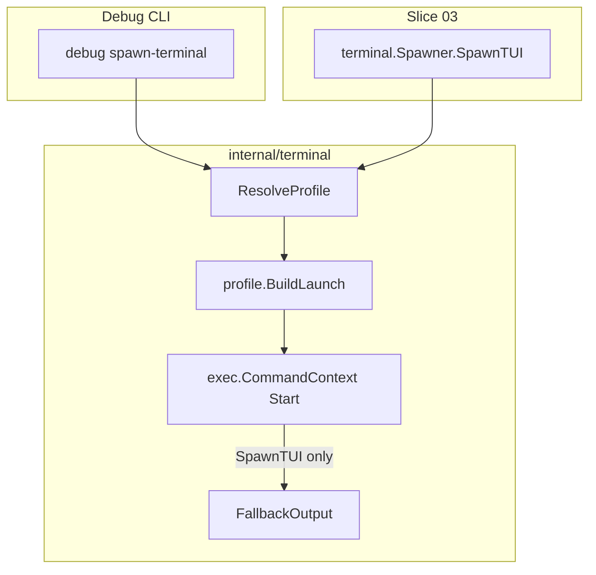

# 02 - Terminal spawner with debug verification

**Type**: AFK

## Parent

[docs/plans/001-project-setup/02-Implementation.md](../../02-Implementation.md) — Phase 2, task 2.2

## References

- [04-Platforms.md — Terminal Spawning](../../04-Platforms.md#terminal-spawning) (background; do not copy string-template code verbatim)
- [03-Configuration.md](../../03-Configuration.md) — `terminal` config block
- [03-daemon.md](./03-daemon.md) — consumer of `SpawnTUI`
- [05-Testing.md](../../05-Testing.md) — manual terminal test matrix
- [docs/terminal.md](../../../../terminal.md) — operator guide (build, verify, emulators)
- [`cmd/clipboard-tui/tui.go`](../../../../../cmd/clipboard-tui/tui.go) — stdin + `tea.WithInputTTY()` when piped

## What to build

Implement `internal/terminal`: detect a terminal emulator, launch a **new window** running a command, and provide a TUI-specific entry point for the daemon.

Two layers:

1. **`Spawn`** — generic launch (powers `debug spawn-terminal`).
2. **`SpawnTUI`** — writes clipboard text to a secure temp file, launches `<executable> tui < tempfile` via the selected profile; on failure, runs **fallback** (write to config dir + open with OS default handler).

Expose through `clipboard-tui debug spawn-terminal` so the slice is verifiable without the daemon.

## Architecture



### Package layout

```
internal/terminal/
  doc.go              // package comment; link docs/terminal.md
  profile.go          // TerminalProfile, ResolveProfile, platform profile lists
  detect.go           // LookPath helper (injectable in tests)
  spawner.go          // Spawner, Spawn, SpawnTUI
  escape.go           // shell quoting for debug / unix inner commands
  fallback.go         // FallbackOutput + ErrUsedFallback
  spawner_windows.go  //go:build windows
  spawner_darwin.go   //go:build darwin
  spawner_linux.go    //go:build linux
  spawner_test.go
  fallback_test.go
```

Use **build tags** for OS-specific profile lists and `BuildLaunch` implementations. Shared logic stays in `spawner.go` / `profile.go`.

## Config

Add to [`internal/config/config.go`](../../../../../internal/config/config.go):

```go
type TerminalConfig struct {
    Emulator    string `json:"emulator"`     // "auto" or profile id
    FallbackDir string `json:"fallback_dir"` // empty = default under GetConfigDir()/output
}
```

JSON example:

```json
"terminal": {
  "emulator": "auto",
  "fallback_dir": ""
}
```

| Source | Precedence |
|--------|------------|
| `CLIPBOARD_TUI_TERMINAL` env | Overrides `terminal.emulator` when set |
| `config.json` `terminal.emulator` | User preference |
| `"auto"` | First profile in OS-ordered list whose binary exists (`exec.LookPath`) |

`DefaultTerminalConfig()`: `Emulator: "auto"`, `FallbackDir: filepath.Join(GetConfigDir(), "output")`.

Validation: `emulator` must be non-empty; if not `"auto"`, must be a known profile ID for the current OS (see [Platform profiles](#platform-profiles)).

## Public API

```go
var (
    ErrNoTerminal   = errors.New("no terminal emulator found")
    ErrUsedFallback = errors.New("terminal spawn failed; opened fallback file")
)

type Spawner struct {
    cfg config.TerminalConfig
    // lookPath func(string) (string, error) — injectable for tests
}

func NewSpawner(cfg config.TerminalConfig) *Spawner

// Spawn launches argv in a new terminal window via the resolved profile.
// The profile may wrap argv in cmd /c or sh -c when required.
// Returns after the launcher process starts (does not wait for the child).
// Honors ctx cancellation before exec.Start.
// Does NOT use fallback on error.
func (s *Spawner) Spawn(ctx context.Context, argv []string) error

// SpawnTUI launches: <executable> tui < tempFileWithText
// On ResolveProfile or Start failure, calls FallbackOutput and returns
// ErrUsedFallback wrapping the original error (daemon should log info, not error).
func (s *Spawner) SpawnTUI(ctx context.Context, executable, text string) error
```

**Daemon contract (slice 03):**

```go
spawner := terminal.NewSpawner(cfg.Terminal)
exe, _ := os.Executable()
err := spawner.SpawnTUI(ctx, exe, clipboardText)
if errors.Is(err, terminal.ErrUsedFallback) {
    log.Info("opened clipboard in fallback file", "err", err)
} else if err != nil {
    log.Error("failed to spawn TUI", "error", err)
}
```

Executable path resolution stays in the daemon; the spawner only runs the given path.

## Platform profiles

```go
type TerminalProfile struct {
    ID       string   // config value: wt, cmd, terminal, gnome-terminal, ...
    Binaries []string // first found via LookPath wins
    BuildLaunch func(innerCmd string) (name string, args []string, err error)
}
```

`ResolveProfile(cfg)`:

- If `emulator == "auto"`: walk `platformProfiles()` in order; return first profile with any binary on `PATH`.
- Else: find profile by `ID`; if binary missing → `ErrNoTerminal`.

**LookPath rule:** probe each name in `Binaries`, not the first token of a shell command (fixes the `open` vs `wt` bug in 04-Platforms pseudocode).

### Ordered defaults (`emulator: auto`)

**Windows** (primary dev platform):

| ID | Binaries (probe order) | Notes |
|----|------------------------|-------|
| `wt` | `wt.exe` | `wt new-tab -- pwsh -NoExit -Command <inner>`; fall back to `cmd` if `pwsh` missing |
| `powershell` | `powershell.exe` | `Start-Process` new window |
| `cmd` | `cmd.exe` | `start` — always available last resort |

**macOS:**

| ID | Binaries | Notes |
|----|----------|-------|
| `terminal` | N/A — use `open` on PATH | `open -a Terminal --args -e sh -c <inner>` |
| `iterm` | N/A — use `open` | `open -a iTerm --args sh -c <inner>` |

For macOS profiles, `LookPath("open")` is the availability check.

**Linux:**

| ID | Binaries |
|----|----------|
| `x-terminal-emulator` | `x-terminal-emulator` |
| `gnome-terminal` | `gnome-terminal` |
| `konsole` | `konsole` |
| `xfce4-terminal` | `xfce4-terminal` |
| `alacritty` | `alacritty` |
| `kitty` | `kitty` |

Implement exact `BuildLaunch` argv per emulator in the `spawner_*.go` files (see 04-Platforms for starting points).

## SpawnTUI: clipboard text delivery

**Do not** pass clipboard text on the command line (`--text`) or via `echo '...'` — injection risk and Windows ~8k argv limit.

**Always:**

1. `os.CreateTemp("", "clipboard-tui-input-*.txt")` with mode `0600`.
2. Write `text`, close file.
3. Build inner command with **file redirect** (platform-specific):
   - **Windows:** `cmd /c "<executable> tui < \"<path>\""` (inside profile launcher).
   - **Unix:** `sh -c '<executable> tui < '\''<path>'\''` using `escape.go`.

Temp files are left for the TUI process to read (acceptable for v1; may accumulate in OS temp).

[`tui`](../../../../../cmd/clipboard-tui/tui.go) already treats non-TTY stdin as piped input and uses `tea.WithInputTTY()` — file redirect satisfies this without new flags.

## Fallback

When `SpawnTUI` cannot resolve a profile or `exec.Start` fails:

1. Write `text` to `<fallback_dir>/clipboard-<unix>.txt` (`0755` dir, `0644` file). Default dir: `GetConfigDir()/output`.
2. Open with OS handler: `cmd /c start` (Windows), `open` (macOS), `xdg-open` (Linux).
3. Return `fmt.Errorf("%w: %v", ErrUsedFallback, originalErr)` so callers can use `errors.Is`.

`Spawn` (debug) **never** falls back — return the underlying error.

## Debug CLI

Add to [`cmd/clipboard-tui/debug.go`](../../../../../cmd/clipboard-tui/debug.go):

```bash
clipboard-tui debug spawn-terminal --command "echo hello"
clipboard-tui debug spawn-terminal --command "echo hello" --emulator wt
```

| Flag | Behavior |
|------|----------|
| `--command` (required) | Run as shell one-liner: Windows `cmd /c <command>`, Unix `sh -c <command>` inside the new terminal |
| `--emulator` | Optional; overrides `cfg.Terminal.Emulator` for this invocation |

Implementation: build inner `cmd /c` or `sh -c` string, pass to `Spawner.Spawn` via profile `BuildLaunch` (not `SpawnTUI`).

Print resolved profile ID on success (e.g. `Spawned using terminal profile: wt`).

## Testing

| Layer | Scope |
|-------|--------|
| Unit | `ResolveProfile` with fake `lookPath`; golden `name, args` from `BuildLaunch`; `escape.go` (`'`, newlines, UTF-8); `FallbackOutput` path + opener (mock exec) |
| Manual | [05-Testing.md](../../05-Testing.md) terminal rows |
| CI | Default `go test` — no GUI; optional `//go:build integration` skipped without display |

Target: ~70% coverage on `internal/terminal` (command construction heavy, exec light).

### Manual verification (Windows)

1. `debug spawn-terminal --command "echo hello"` → new window shows `hello`.
2. Small Go test program or integration call to `SpawnTUI` with local binary + sample text → TUI shows text.
3. Set `"emulator": "nonexistent"` → `SpawnTUI` opens fallback `.txt` in default editor.

## Implementation order

1. `TerminalConfig` + defaults + validation + `CLIPBOARD_TUI_TERMINAL` in loader.
2. `profile.go`, `detect.go`, `spawner_{windows,darwin,linux}.go`.
3. `escape.go`, `spawner.go` (`Spawn`, `SpawnTUI`).
4. `fallback.go`.
5. `debug spawn-terminal` + [docs/terminal.md](../../../../terminal.md).
6. Unit tests.
7. Manual smoke on Windows.

## Acceptance criteria

- [x] `TerminalConfig` on `Config` with defaults, validation, and `CLIPBOARD_TUI_TERMINAL` env override
- [x] `internal/terminal` with `Spawner`, `Spawn`, `SpawnTUI`, `ErrNoTerminal`, `ErrUsedFallback`
- [x] Auto-detect + explicit `terminal.emulator` for Windows (`wt`, `powershell`, `cmd`), macOS (`terminal`, `iterm`), Linux (≥4 emulators from table above)
- [x] `SpawnTUI` uses temp-file stdin redirect compatible with existing `tui` stdin handling
- [x] `fallback.go` on `SpawnTUI` failure; configurable `fallback_dir`
- [x] `clipboard-tui debug spawn-terminal --command "echo hello"` opens a new terminal
- [x] Clipboard text never passed through shell `echo` (file redirect only for `SpawnTUI`)
- [x] `Spawn` returns clear errors without fallback
- [x] Unit tests: profile resolution, launch argv construction, escape, fallback paths
- [x] [docs/terminal.md](../../../../terminal.md) with verify steps
- [x] Windows verified on developer machine; macOS/Linux limitations noted in `docs/terminal.md`

## Non-goals

- Daemon loop, PID file, poller/hotkey wiring (slice 03)
- Debouncing multiple simultaneous TUI windows
- Wayland-specific terminal APIs
- Installing terminal emulators for the user
- Deleting temp input files after TUI exit (v1)

## Blocked by

- Phase 1 (Project skeleton & CLI scaffolding)
